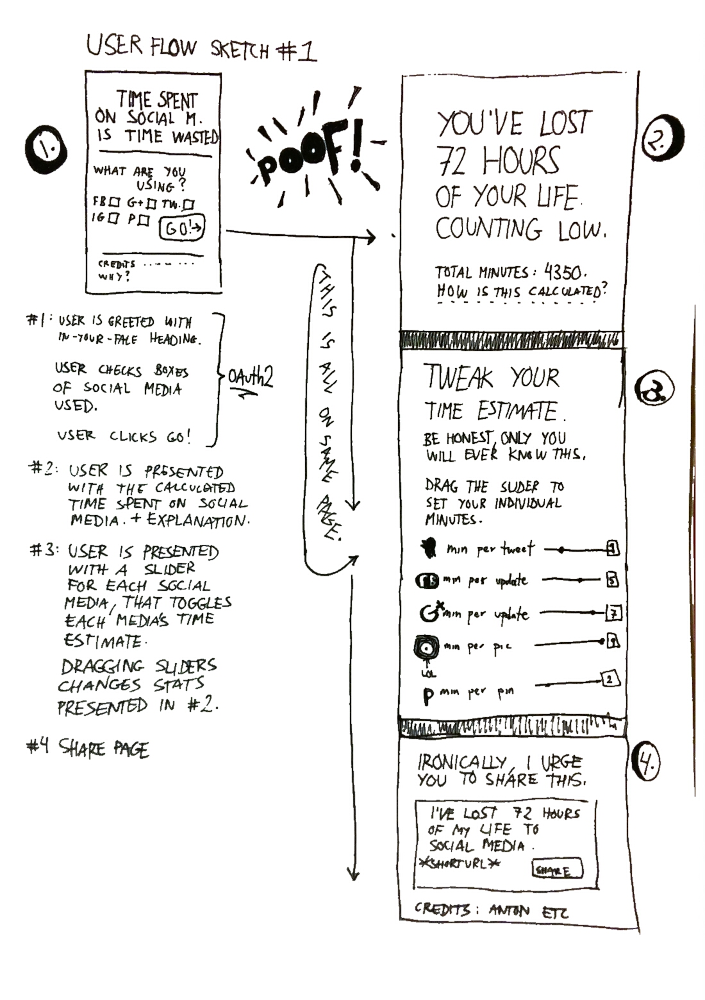

# hours-lost
_Hours lost_ ger dig en överblick över alla timmar du slösat bort på sociala medier.
Genom att koppla samman en användares totala användning av sociala medier med en tidsuppskattning ges användaren en total summa minuter den använt.

Applikationen kommer att stödja Twitter, Facebook och Instagram. Efter att den initiala, ganska snälla, uträkningen gjorts kommer användaren att få självskatta sin egentliga tid per tweet, Facebook-inlägg och Instagrambild.
Efter detta presenteras en ny uträkning. Uträkningen går sedan att dela med sina vänner.

## Tekniker som huvudsakligen kommer att användas

Stacken är JS-vänlig, från klient till DB.

**Tekniker:**

* AngularJS
* Node.js (Express, EJS)
* MongoDB (Mongoose)
* Digital Ocean

## Första utkast på konceptskiss

